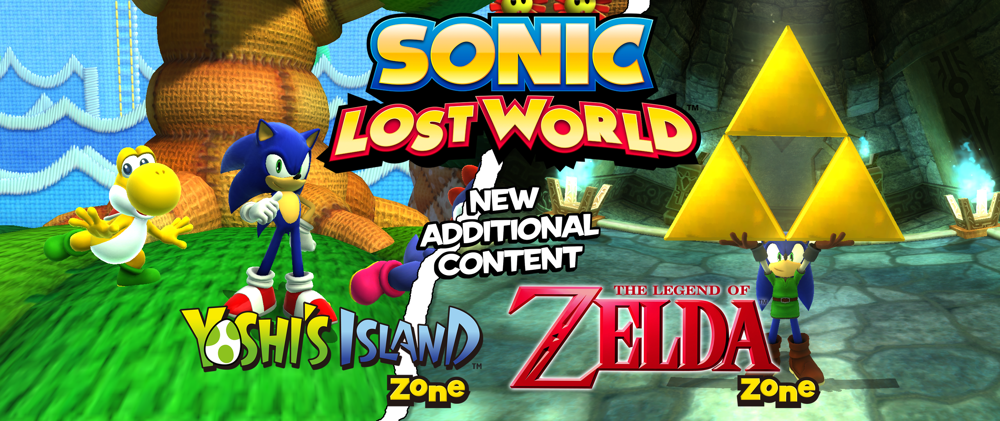
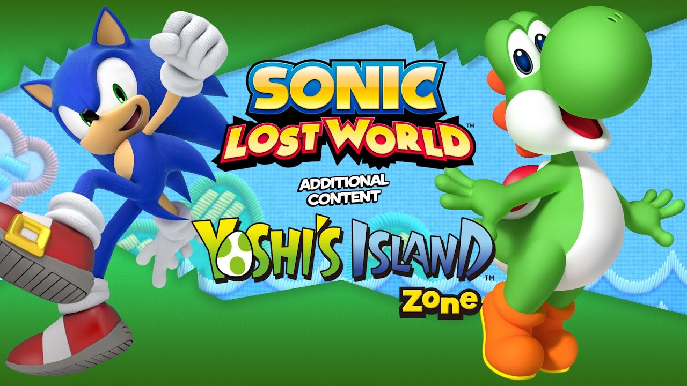
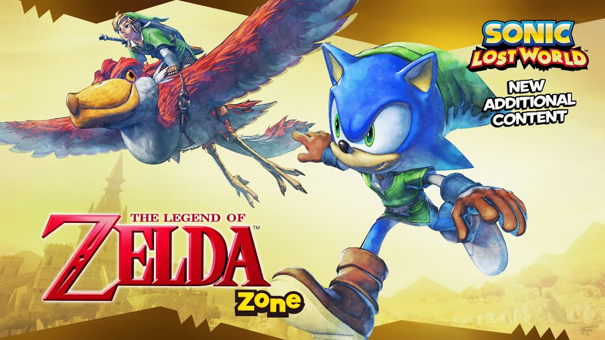
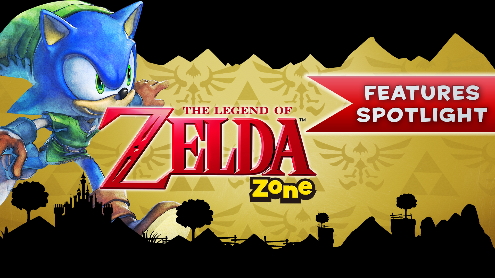

	<h1>Sonic Lost World DLC Restoration</h1>
	
	 
A full restoration of the two exclusive DLCs released for Sonic Lost World (Wii U) for the PC release of the game.

# Releases
The Yoshi's Island Zone DLC part of the mod was released on [GameBanana](https://gamebanana.com/maps/216170) on the 22nd of April 2021. 

	
	 
<a href="https://www.youtube.com/watch?v=S9FxpRoQ3Gk">Yoshi's Island Zone Restoration | Release Trailer</a>

 

The Legend of Zelda Zone is currently in development, currently set to release on the 12th of February 2022. 

	
	 
<a href="https://www.youtube.com/watch?v=gzpvNMKdbBo">The Legend of Zelda Zone Restoration | Teaser Trailer</a>

	
	 
<a href="https://www.youtube.com/watch?v=s-giYNQen64">The Legend of Zelda Zone Restoration | Features Spotlight</a>

# Build instructions
1. Download Source Code
2. Open the .sln file in [Visual Studio 2019](https://visualstudio.microsoft.com/vs/)
3. Build for x86

# Development History
[Yoshi's Island Zone Restoration](https://docs.google.com/document/d/1x-BSqP11XWgherDbQqTM6RD0AfNC1mxdWl5zRWHa6dg)  
The Legend of Zelda Zone Restoration (TBD)
